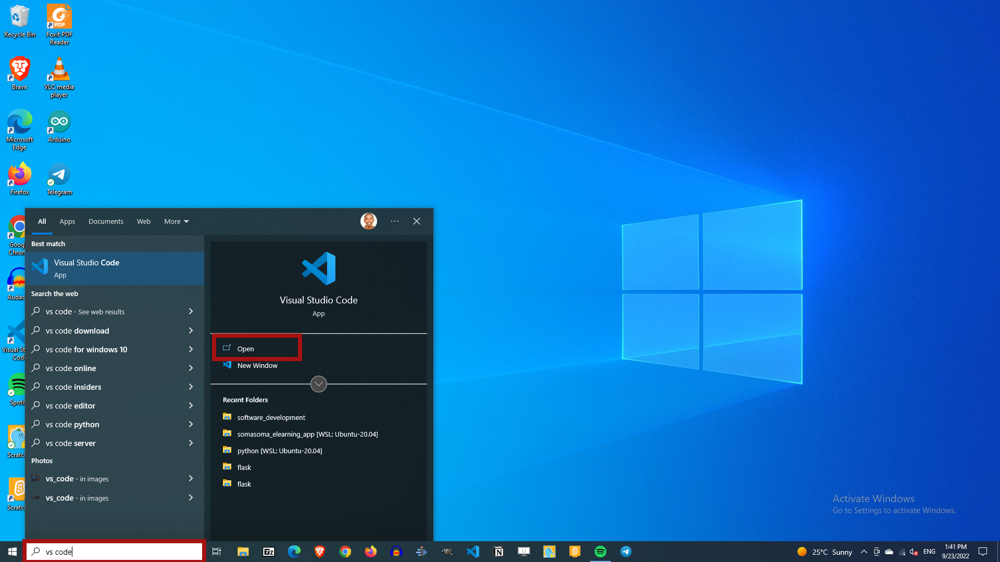
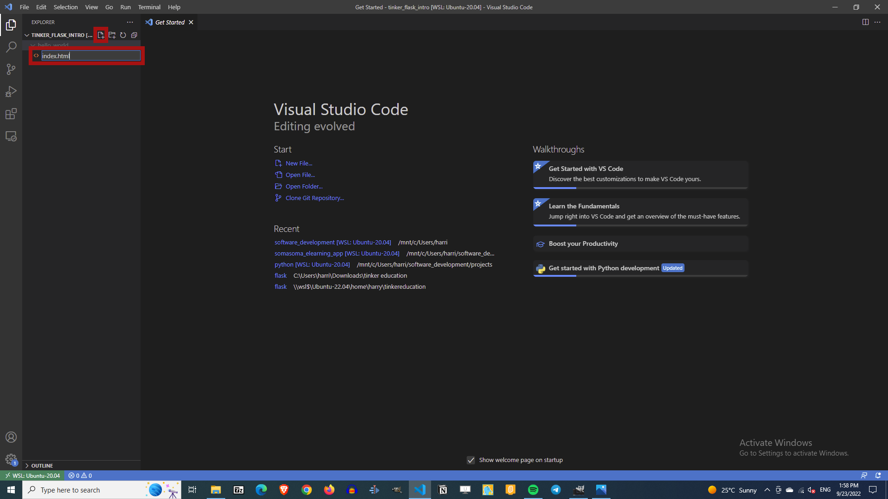
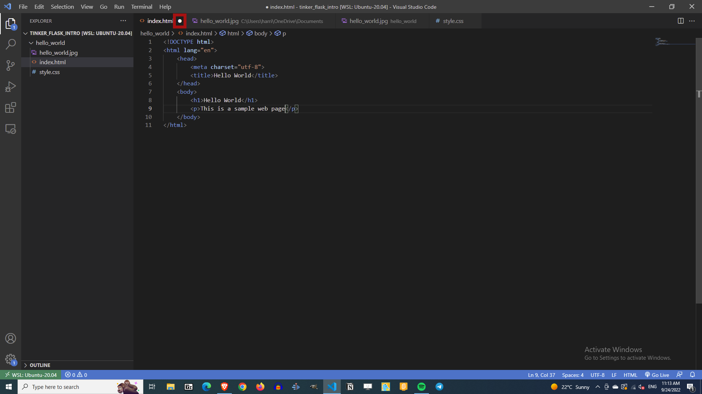
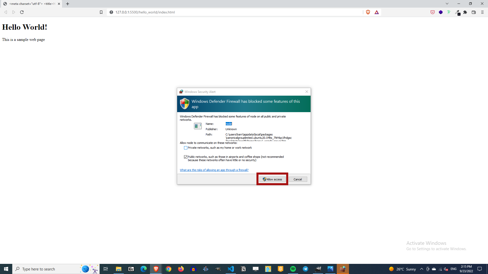
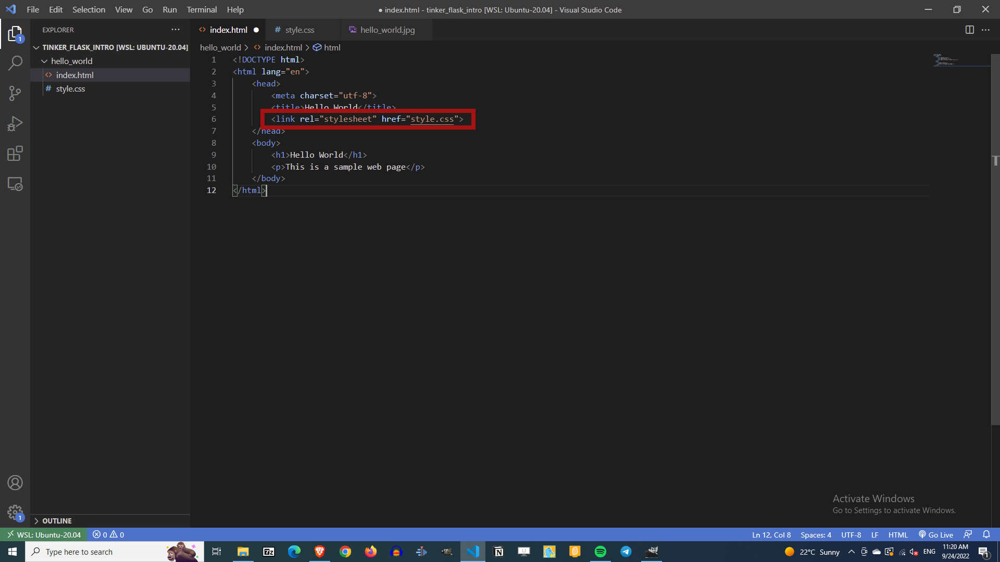
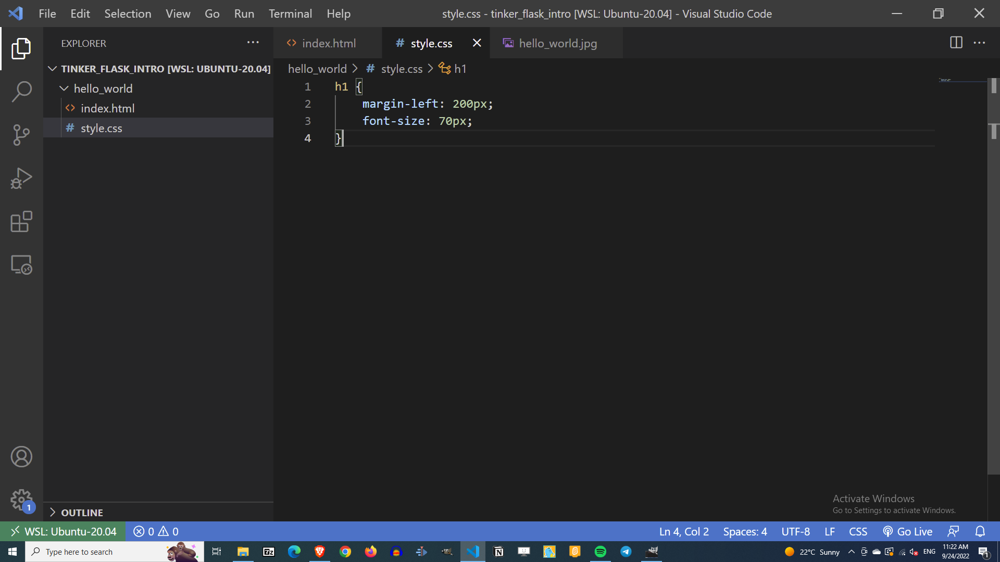
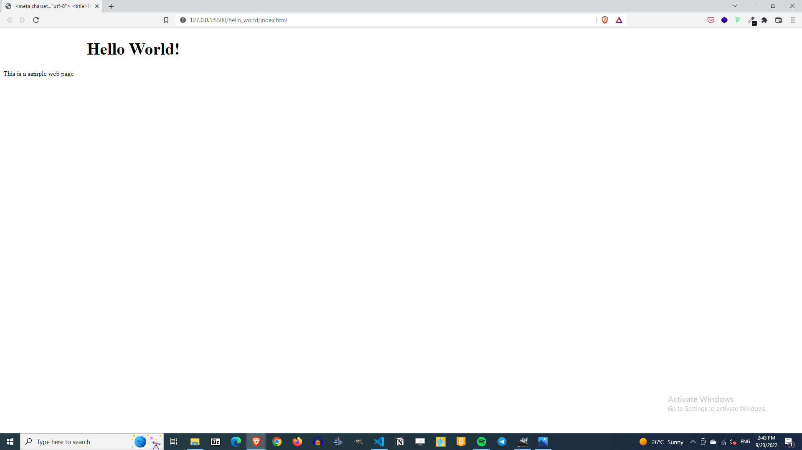
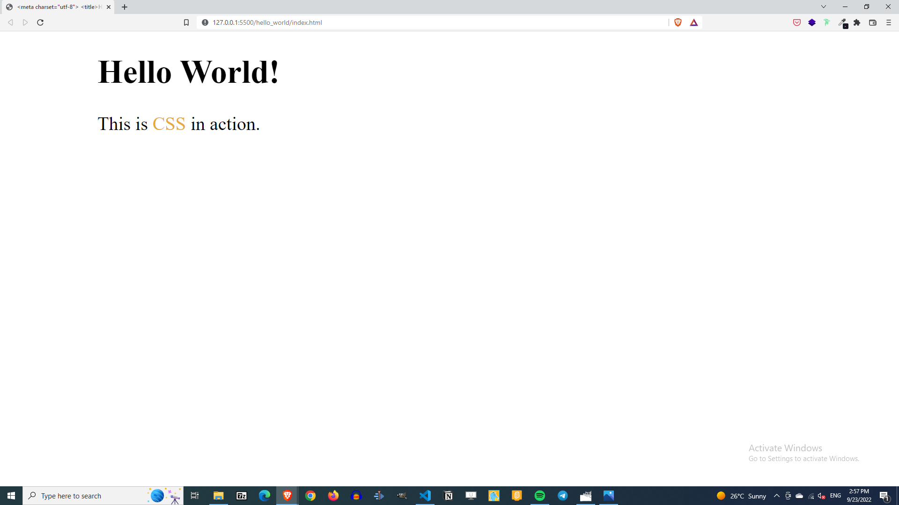

# Building Your First Web Page

Pre-internet era, printed books that were tightly bound were the primary source of information. Everyone had to invest the effort to access or acquire a book if they needed to learn something. Today, things have drastically changed. You simply open a web browser, jump to your favourite web search engine, and search away. It is like an incredible amount of information rests at your fingertips. The fact that you are able to access this information on the internet highlight the chance that someone somewhere has built a website with the exact information you are looking for.

Throughout this tutorial, these are the reference links of the things we will be looking at. At your own convinience, you can navigate to whatever article you want to refer to:


1. [Getting Started with HTML and CSS](01_getting_started_with_HTML_and_CSS.md) (this article)
2. [Git and GitHub](02_git_and_github.md)
3. [Getting Started with Flask](03_getting_started_with_flask.md)
4. [Introduction to Bootstrap](04_bootstrap_intro.md)
5. [Working with Templates](05_working_with_templates.md)
6. [Web forms](06_web_forms.md)
7. [Database](07_database.md)


This article will cover these topics:

- [What Are HTML and CSS](#what-are-html-and-css)
- [Common HTML Terms](#common-html-terms)
- [HTML Document Structure](#html-document-structure)
- [Working with CSS](#working-with-css)
- [Application of Lessons Learnt](#application-of-lessons-learnt)

If you would like to see the completed project, you can browse [this repository](https://github.com/tastebolder/first-web-app).


## What Are HTML and CSS

Before you get too excited about building a website, we need to understand how one is built. We need to know what the building blocks of a website are, what role they play and how different they are from each other.

- **HTML**, short for HyperText Markup Language, is used to give structure to the content of a web page. It defines the headings, paragraphs, images among many other things. 

- **CSS**, short for Cascading Style Sheets, on the other hand, is primarily used to style a web page by improving its appearance using colors, fonts et cetera.

These two languages are interdependent, and should remain that way. It is best practice not to write CSS in HTML or vice versa. As a rule, HTML will always represent content while CSS will always represent appearance of that content.

## Common HTML Terms

All the HTML terms we will discuss below may be new to you, and as with everything new, we need to familiarize ourselves with the terms used. To begin, we will look at [_elements_](#elements), [_tags_](#tags) and [_attributes_](#attributes).


### Elements

Elements are used to define the structure and content of objects within a page. They are identified by the use of less-than and greater-than angle brackets, `< >`, surrounding the element name.  Example elements include:

- Headings: `<h1>`, `<h2>`, `<h3>`, `<h4>`, `<h5>`, `<h6>`
- Paragraphs: `<p>`
- Div :`<div>` among many more


### Tags

The use of less-than and greater-than angle brackets surrounding an element creates what is known as a tag. Tags most commonly occur in pairs of opening and closing tags. An opening tag marks the beginning of an element. It consists of a less-than sign followed by an element’s name, and then ends with a greater-than sign; for example, `<div>`.

A closing tag marks the end of an element. It consists of a less-than sign followed by a forward slash and the element’s name, and then ends with a greater-than sign; for example, `</div>`. The content that falls between the opening and closing tags is the content of that element.

```html
<!-- The anchor tag used to create a link -->
<a> ... </a>
```


### Attributes

Attributes are properties used to provide additional information about an element. The most common attributes include the `id` attribute, which identifies an element; the `class` attribute, which classifies an element; the `src` attribute, which specifies a source for embeddable content; and the `href` attribute, which provides a hyperlink reference to a linked resource.


Attributes are defined within the opening tag, after an element’s name. Generally attributes include a name and a value. The format for these attributes consists of the attribute name followed by an equals sign and then a quoted attribute value.

```html
<a href="http://www.gitauharrison.com/">Gitau Harrison</a>
```

## HTML Document Structure

Now that we know and understand a little about HTML, let us find out how we can create a structure for an HTML document.

```html
<!DOCTYPE html>
<html lang="en">
    <head>
        <meta charset="utf-8">
        <title>Hello World</title>
    </head>
    <body>
        <h1>Hello World</h1>
        <p>This is a sample web page.</p>
    </body>
</html>
```

HTML files are plain text documents with a `.html` extension. All HTML documents have a required structure that includes the following declaration and elements: `<!DOCTYPE html>`, `<html>`, `<head>`, and `<body>`.

- `<!DOCTYPE html>` is used to inform web browsers which version of HTML is being used. It is always placed at the very top of the file. What we have above is an instruction to the web browser to use the latest version of HTML
- `<html> ... </html>` immediately follows `<!DOCTYPE html>`. The opening tag signifies the beginning fo the document, while the closing tag signifies the end of the document. Inside the `<html>` tages, we have `<head>` and `<body>` elements.
- `<head>` is used to display the metadata which is not necessarily displayed on the page itself, but rather on the document title (top of title bar in a browswer window).
- `<body>` will carry all the visible content within a web page. In our example above, we have a title and a paragraph within the `<body>` tags.

To begin writing your HTML, you will first need a text editor. By this time, you should have VS Code installed in your Operating System. If you have not done so, consider checking [this elaborate tutorial](https://medium.com/@gitauharrison/get-started-with-the-windows-subsystem-for-linux-e49264a5274e) on how to set everything up on your Windows computer before proceeding. 


Once set up, open VS Code by searching it among your apps. Click on the "Open" command to launch it:



With our editor open, we will begin by creating a folder called _hello_world_. Click on the "New Folder" icon shown below.


Then, name the folder _hello_world_ and press "Enter":


Click on _hello_world_ folder until you can see it highlighted in a shade of blue.


Finally, we need to create a file called _index.html_ just the way we have done for the folder.



What we need to do now is to create the structure of our HTML file. If you go back to the section [HTML Document Structure](#html-document-structure), you will see the default file structure.



Notice that once you have finished writing your code there is a white dot at the top of the _index.html_ file. This shows that the file has had changes, and therefore, needs to be saved. Click "Ctrl + S" on your keyboard to save your changes.

To see your first web page on a browser, you need to run the _index.html_ file. But before we do that, let us install a new extension called "Live Server". Click on "Extensions", then search for "Live Server". Once found, click "Install in WSL: Ubuntu-20.04".


Give it some time and you will notice the icon "Go Live" at the bottom right corner of your VS Code.


To see your web page, all you need to do now is to click on the "Go Live" icon. Your applciation will launch in your default computer browser.



You may notice that Windows Defender Firewall pops up to notify you that it has blocked some features of our new app. Click "Allow access" and all will be well moving forward.

Congratulations! That is your very first custom web page.


## Working With CSS

As we have learnt earlier, CSS is used primarily to style a web page. You can agree with me that the _hello_world_ template we have just created is so flat; it has no sense of attraction. Let us try modifying this page to fit these requirements:

- Make the heading much bigger
- Increase the font size of the paragraph and add some colors!

If you can remember, we said that it is best practice to separate HTML from CSS. Let us begin by creating a new file called _style.css_ inside our original folder _hello_world_.


The next step is to link these two files. The linkage normally happens inside the `<head>` element of _index.html_ file. Add this line:

```html
<link rel="stylesheet" href="style.css">
```




We are now ready to make changes that will improve the appearance of our template. Let us do the following inside _style.css_



Above, we are instructing our browser to increase the font-size of our heading after moving it from the left side of the marging. Your outcome should be similar to this below:




CSS syntax is a bit different from that of HTML. In CSS, we do not have the less-than (`<`) or greater-than (`>`) signs. Instead, we make use of curly braces. Our custom styles are enclosed in the curly braces. What we have done here is to tell the browswer to add 200 pixels to the left of the `h1` element as well has give it a font size of 70 pixels. 

As cool as that is, let us also style our paragraph. Let us begin by first modifying the content of the `p` element before applying our styles. Add these changes:

```html
<!-- index.html -->

<p>This is <span>CSS</span> in action</p>
```

Now, we can modify our CSS file to apply specific styles to the entire document.

```css
/* style.css */

h1, p {
    margin-left: 200px;
}
h1 {
    font-size: 70px;
}
p {
    font-size: 40px;
}
span {
    color: orange;
}
```

Here, we are telling the browser to move both the `h1` and teh `p` elements 200 pixels to the left. The `h1` element will have a font size of 70 pixels while the paragraph wil be 40 pixels big. The `span` element is usually used to further select a particular section of an element, in our case we are selecting the "CSS" word of the paragraph. We then order the browser to turn it to orange.

Be sure to save your changes by pressing "CTrl + S".




## Application of Lessons Learnt

Now that we know how create a simple web page, let us test our skills further by building this sample web page.


This sample website features a simple navigation bar, some text and an image. Can you build it on your own?

The first thing that you need to do is to update your _index.html_ file with the extra content you can see above. Then, you will apply some stylings to achieve this very noob outcome. Update your HTML file as follows:

```html
<!-- index.html -->

<!DOCTYPE html>
<html lang="en">
    <head>
        <meta charset="utf-8">
        <title>Hello World</title>
        <link rel="stylesheet" href="style.css">
    </head>
    <body>
        <nav>
            <ul>
                <li class="logo"><a href="index.html">Test Logo</a></li>
                <li class="about"><a href="#about">About</a></li>
                <li class="contact"><a href="#contact">Contact</a></li>
            </ul>
        </nav>        
        <h1>Hello World</h1>
        <p>This is <span>CSS</span> in action</p>
        <p>
            
        </p>
    </body>
</html>
```

The only addition here is the use of the `nav` element to create a navigation bar. This bar has three links, the _test logo_, the _About_ and the _Contact_. I have added one more paragraph with an image in it so that our initial paragraph styles are used.


Inside our _style.css_ file, we can now style our navigation bar to fit our sample description, as well as limit the size of the image to pre-determined height and width.

```css
h1, p {
    margin-left: 100px;
}
h1 {
    font-size: 70px;
}
p {
    font-size: 40px;
}
span {
    color: orange;
}
a {
    text-decoration: none;
}

/* Navigation bar */
nav {
    display: flex;
    justify-content: space-between;
    align-items: center;
    background-color: gray;
}
nav ul li {
    border: 1px solid green;
    padding: 10px;
    list-style-type: none;
    display: inline;
}
/* Images */
img {
    height: 300px;
    width: 450px;
}

```

The navigation bar uses `display: flex` to flexibly display the content. Since the navigation items are list elements, the command `list-style-type: none` will remove the bullet points from the output. `display: inline` will make them to align horizontally within the navigation bar.

That is all for now. I hope you have some basic understanding of using HTML and CSS. To perfect, you will need constant practice a lot more study.