# Introduction to Git and GitHub


Throughout this tutorial, these are the reference links of the things we will be looking at. At your own convinience, you can navigate to whatever article you want to refer to:


1. [Getting Started with HTML and CSS](01_getting_started_with_HTML_and_CSS.md)
2. [Git and GitHub](02_git_and_github.md)  (this article)
3. [Getting Started with Flask](03_getting_started_with_flask.md)
4. [Introduction to Bootstrap](04_bootstrap_intro.md)
5. [Working with Templates](05_working_with_templates.md)
6. [Web forms](06_web_forms.md)
7. [Database](07_database.md)
8. [User Login](08_user_login.md)
9. [Profile Page and Avatars](09_profile_page_and_avatars.md)
10. [Error Handling](10_error_handling.md)
11. [Pagination](11_pagination.md)
12. [Working With Email](12_working_with_email.md)
13. [Better-looking Application](13_better_looking_application.md)
14. [Timestamp](14_timestamp.md)
15. [Deployment on Render](15_deployment_on_render.md)


This article will cover these topics:

- [Overview](#overview)
- [Getting Started with Git and GitHub](#getting-started-with-git-and-github)
- [Configure Git in Ubuntu](#configure-git-in-ubuntu)
- [Connect to GitHub Using SSH](#connect-to-github-using-ssh)
- [Add Your First Project to GitHub Using Git](#add-your-first-project-to-github-using-git)


## Overview

**[Git](https://git-scm.com/)** is an open-source version control tool. For example, if you build your first project, you can call it Version 1. Thereafter, you can improve on it, make some changes and have the updated project as Version 2. Git allows for this type of versioning.

To better understand what Git is, let us break it down:

- **Control System**: This basically means that Git is a content tracker. So Git can be used to store content — it is mostly used to store code due to the other features it provides.
- **Version Control System**: The code which is stored in Git keeps changing as more code is added. Also, many developers can add code in parallel. So Version Control System helps in handling this by maintaining a history of what changes have happened. Also, Git provides features like branches and merges, which I will be covering later.
- **Distributed Version Control System**: Git has a remote repository which is stored in a server and a local repository which is stored in the computer of each developer. This means that the code is not just stored in a central server, but the full copy of the code is present in all the developers’ computers. Git is a Distributed Version Control System since the code is present in every developer’s computer.
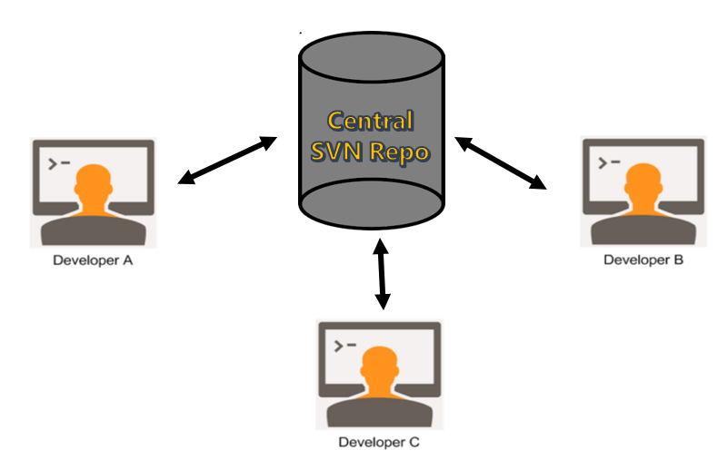

**[GitHub](https://github.com)**, on the other hand, is a cloud service that allow you to store your projects' versions.

In a real-world project, there are multiple developers working in parallel. To ensure that all work is managed well, a version control system like Git is normally used. Sometimes the requirements of a project changes. In such an event, it may become necessary to revert to a previous version of the project. Git is able to handle this scenario very well.

## Getting Started With Git And GitHub

In this section, you will learn how to check if your operating system has _git_ already installed. You will also learn how to create a GitHub account to be used to store your code in the cloud.

### Check For Git

First and foremost, you need to install _git_ in your operating system. At this point, if you have been following along, you should have it already installed. If you don't have it, please refer to the our earlier lesson when setting up the [Windows Subsystem for Linux](https://medium.com/@gitauharrison/get-started-with-the-windows-subsystem-for-linux-e49264a5274e).

How can you know that you have git installed in your operating system? Run this code below in your VS Code terminal:

```python
git --version
```


What this tells you is that you have "git version 2.25.1" already installed in your system.

### Create a GitHub Account

GitHub allows you to not only access your code remotely, it also allows other developers interested in your project to contribute to your work. The first thing you want to do is to create an account. Head over to https://github.com to get started. Once there, click on the the "Sign Up" button to begin creating your account.


Follow the instructions as guided.


With your account now created, you can check your profile page. Click on your avatar as seen below, then select "Your Profile".


You will be redirected to your GitHub profile.

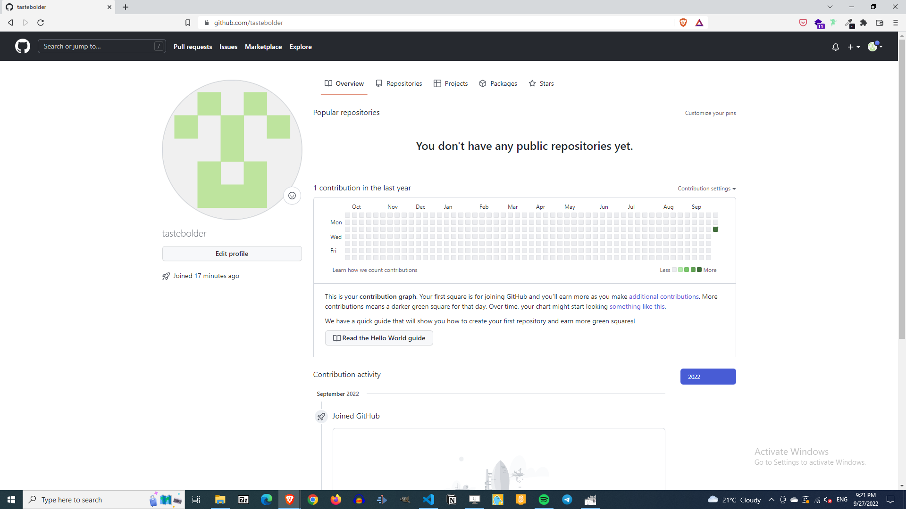


## Configure Git in Ubuntu

The next step will be to configure the _git_ available in your local computer. This process is done only once. 


### Step 1

You need to add your name to _git_ configurations. Run the code below in your VS Code terminal:

```python
git config --global user.name "<put here your username>"
```


### Step 2

Thereafter, you need to add your email address to _git_ configurations. Run the code below in your VS Code terminal:

```python
git config --global user.email "<put here your email@example.com>"
```

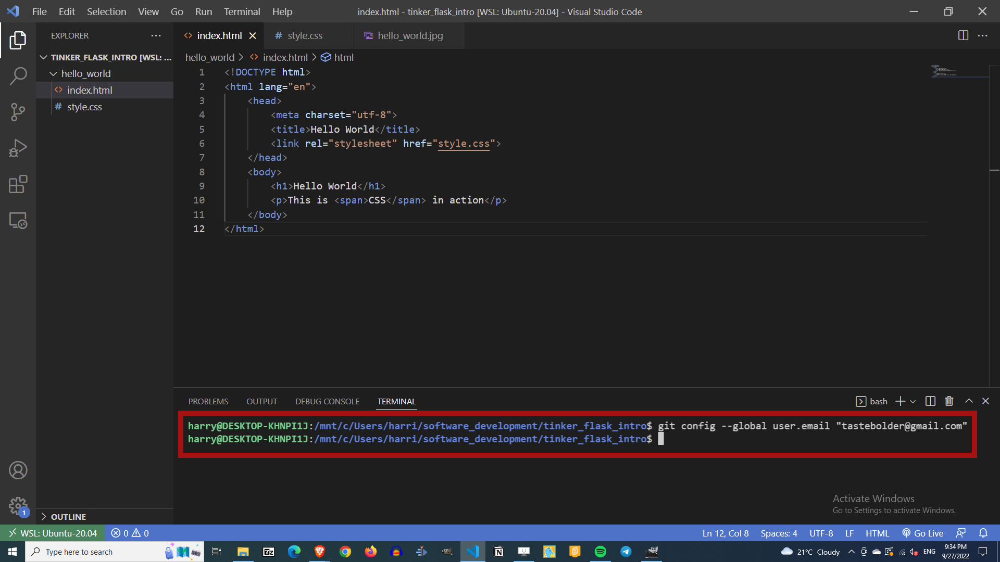


### Step 3

Confirm all the changes you have made in the _git_ configuration file by running the code below in your VS Code terminal:

```python
git config --list
```


## Connect to GitHub Using SSH

Do not worry if you don't understand what SSH means. In short, SSH allows you to connect to GitHub without supplying your username and password during each visit. An SSH key is normally used to facilitate this transaction. If at any one point you feel like your account is compromised, feel free to revoke it.

### Step 1

List all existing SSH keys, and check for an existing public SSH key (public SSH keys end with _.pub_). Run this code in your VS Code terminal:

```python
ls -al ~/.ssh
```


There is a good chance that when you run the command above you will get the error `ls: cannot access '/home/harry/.ssh': No such file or directory`. This means that no such file or directory currently exists in our file system.


### Step 2

Run this code in your VS Code terminal to generate a key pair:

```python
ssh-keygen -t rsa -b 4096 -C "<your GitHub email address goes here>"
```

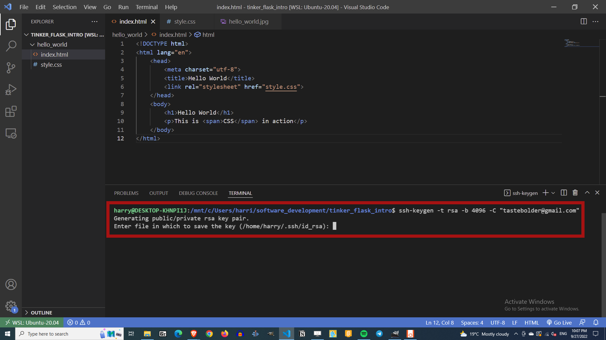

You will be prompted to enter a file in which to save the key. Simply press "Enter" on your keyboard to save it to the default location. Notice that two new files have been created (the _/home/harry/.ssh/id_rsa_ and  _/home/harry/.ssh/id_rsa.pub_ which initially could not be found).

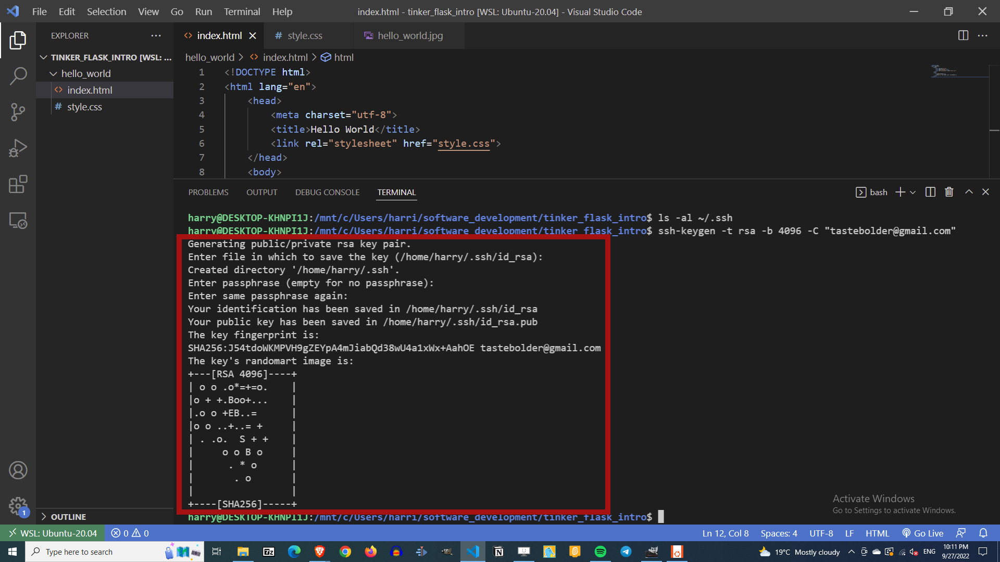

**This information should be private, and should not shared with anyone.** I am showing it right now for learning purposes but soon after this tutorial ends, I will revoke it and generate a new one.

Right now, if you try to run the command `ls -al ~/.ssh`, you will see some output:


### Step 3

Now that we have our SSH keys generated, we need to copy the public key to our clipboard. Run this code in your VS Code terminal:

```python
cat ~/.ssh/id_rsa.pub
```


You will see a long cryptographic key displayed in your terminal. **Carefully copy that key, making sure you do not add whitespaces or newlines.**


### Step 4

Paste the contents in your clipboard to this link on your GitHub account: https://github.com/settings/ssh/new

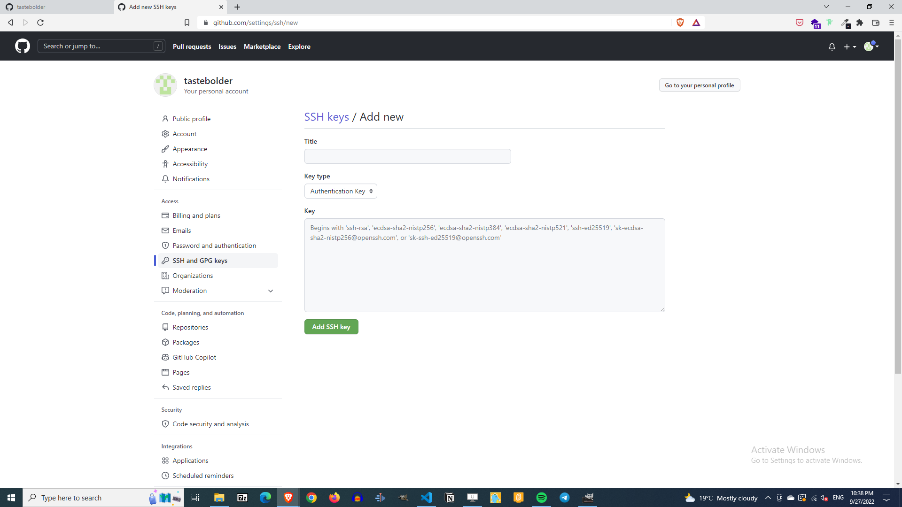

Add a title and the key as seen in the image below:

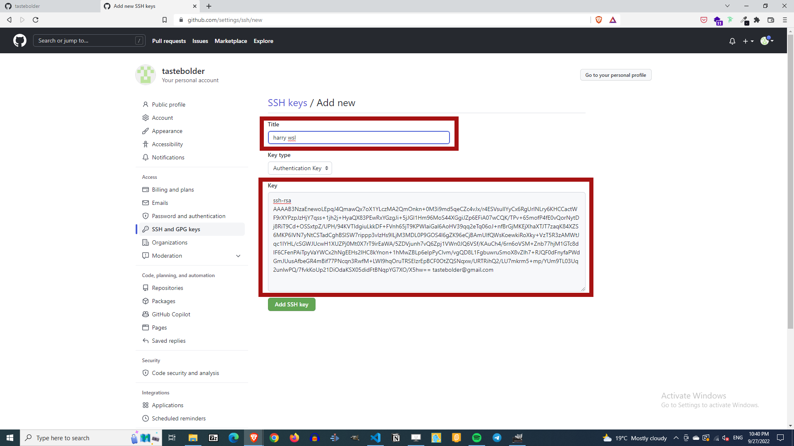

Once done, press the green button "Add SSH key". You will see the key added to your Authentication Keys list.


### Step 5

The last step is to test your SSH connection. Run this code in your VS Code terminal:

```python
ssh -T git@github.com
```

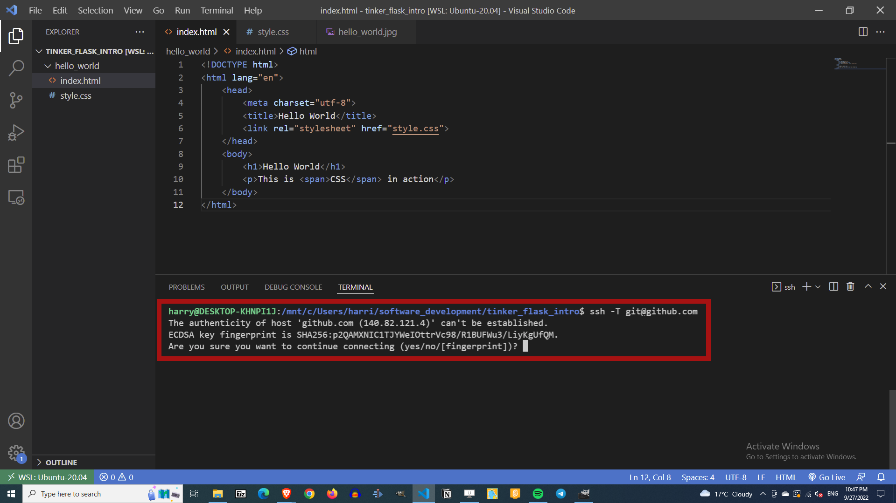

You will be prompted to answer a few questions. Do so and you will see "github.com, 140.82.121.4" has been permanently added to the ist of known hosts.


## Add Your First Project to GitHub Using Git

From our lesson [Getting Started with HTML and CSS](01_getting_started_with_HTML_and_CSS.md), you learnt how to create your first web page. We will use this project to understand the underlying worflow used by _git_ and _GitHub_. There are a few definite steps to follow whenever you want to push the code found in your local machine to a remote server such as GitHub.


- `git init` initializes a brand new Git repository and begins tracking an existing directory. It adds a hidden subfolder within the existing directory that houses the internal data structure required for version control.

- `git clone` creates a local copy of a project that already exists remotely. The clone includes all the project's files, history, and branches.

- `git add` stages a change. Git tracks changes to a developer's codebase, but it's necessary to stage and take a snapshot of the changes to include them in the project's history. This command performs staging, the first part of that two-step process. Any changes that are staged will become a part of the next snapshot and a part of the project's history. Staging and committing separately gives developers complete control over the history of their project without changing how they code and work.

- `git commit` saves the snapshot to the project history and completes the change-tracking process. In short, a commit functions like taking a photo. Anything that's been staged with git add will become a part of the snapshot with git commit.

- `git status` shows the status of changes as untracked, modified, or staged.

- `git branch` shows the branches being worked on locally.

- `git merge` merges lines of development together. This command is typically used to combine changes made on two distinct branches. For example, a developer would merge when they want to combine changes from a feature branch into the main branch for deployment.

- `git pull` updates the local line of development with updates from its remote counterpart. Developers use this command if a teammate has made commits to a branch on a remote, and they would like to reflect those changes in their local environment.

- `git push` updates the remote repository with any commits made locally to a branch.

Below, we will look at two approaches to working with Git and GitHub:

1. [Start With A Project Found In Your Local Computer](#approach-1-start-with-a-project-found-in-your-local-computer)
2. [Get a Project Already Found on GitHub](#approach-2-get-a-project-already-found-on-github)


### Approach 1: Start With A Project Found In Your Local Computer


Let us assume you have a project in your laptop, or desktop. How do you ensure that it can be located in a version control server like GitHub? Below are the steps to follow when you want to add your project to a remote server.

### Step 1

Create a new repository on GitHub. Click on the "+" icon as seen below, then select "New Repository".

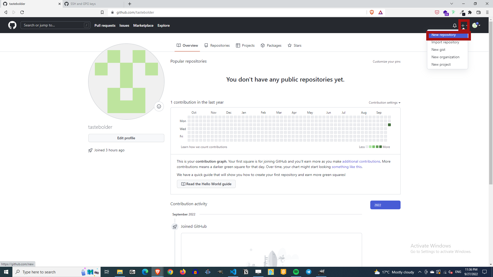

GitHub will redirect you to create a new repo (or repository) by providing a form for your repo name as well as an optional description for the repository.

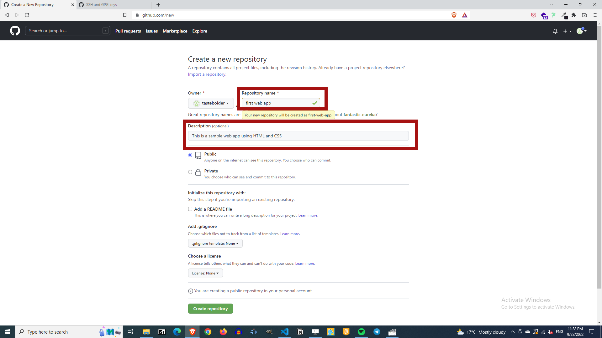

Complete the creation of the new repository by clicking on the green button "Create repository".

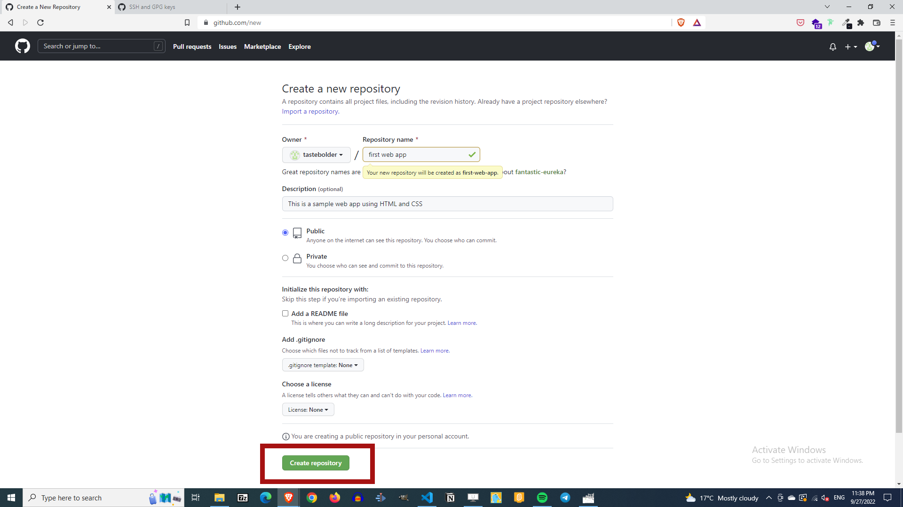

You will see the page below. It contains instructions on what to do when you create a new repository on the command line. So, in the event you forget what the commands are, you can refer to these instructions.


Remember that above, we connected our account to GitHub using SSH. What we need to do now is to click on the SSH tab on this new repo so that we can get an SSH link to our brand new repository.


### Step 2

To initialize your project's directory, ensure that you are in the actual project directory. In my case below, I have a folder called _hello_world_.

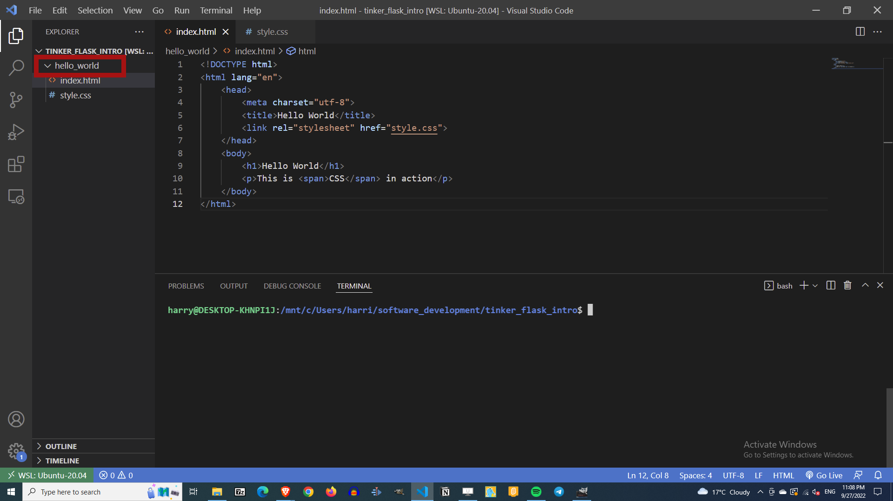

What needs to be done is to navigate into the _hello_world_ folder. This can be done via the terminal by running the command:

```python
cd hello_world
```


Notice that my current working directory has changed from _tinker_flask_intro_ to _tinker_flask_intro/hello_world_. Now I can run the code below to initialize _hello_world_ as a _git_ repository.

```python
git init
```


Notice that the file structure in the far left of VS Code have changed to green. This means that they are being tracked. An alternative way to know that they directory's contents are being tracked is by running this command in your terminal:

```python
git status
```


Our two files, _index.html_ and _style.css_, are "red" in color. This means that we have made some changes in them and _git_ is tracking them.


### Step 3

Add the changes in the files to version control by running these commands:

```python
git add index.html style.css
```


The command `git add` allows us to add the individual files we want tracked by _git_. If you want to confirm if the changes in the files have been added, run the command below:

```python
git status
```

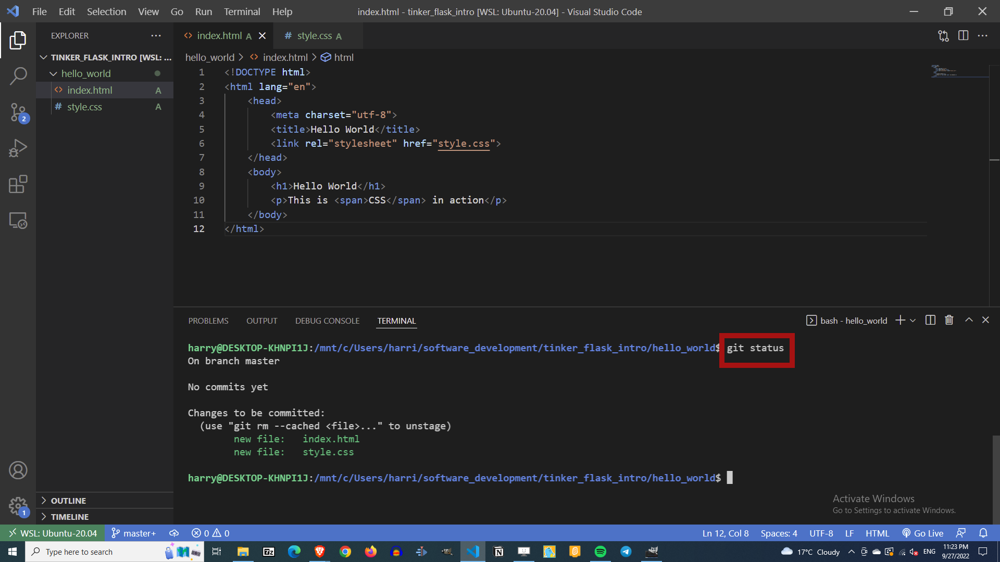

Notice that the two files are now "green" in color. These means that the changes we made in them are now added to _git_.

### Step 4

It is now time to commit the changes we have made. This can be done by running the command below:

```python
git commit -m "Initial commit"
```

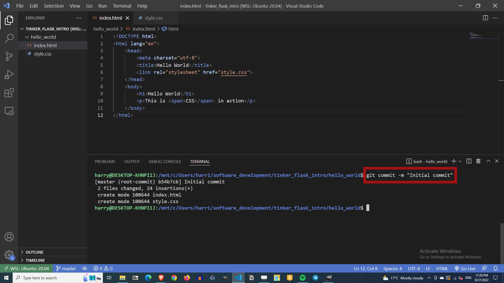


The `-m` flag stands for the word "message", which allows us to add a custom message such as "Initial commit". The message should properly describe what the change is all about.

If you try to run `git status`, you will notice that we have no tracking concerns raised by _git_.

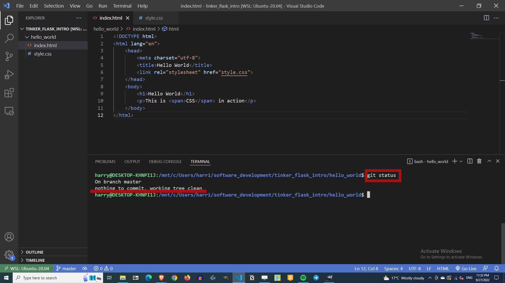


### Step 5

The next step will be to add a remote repository to git. This can be achieved by using our SSH link to the new repository. Go back to the new repositroy and copy the link shown below:

```python
git@github.com:tastebolder/first-web-app.git
```


### Step 6

Next, we need to create a new branch called main to comply with the modern developments in the naming of branches. Run the command below in your VS Code terminal:

```python
git branch -M main
```


This command will switch the main branch found in GitHub to _main_.

### Step 7

Paste the copied link to your VS Code terminal as seen below:

```python
git remote add origin git@github.com:tastebolder/first-web-app.git
```

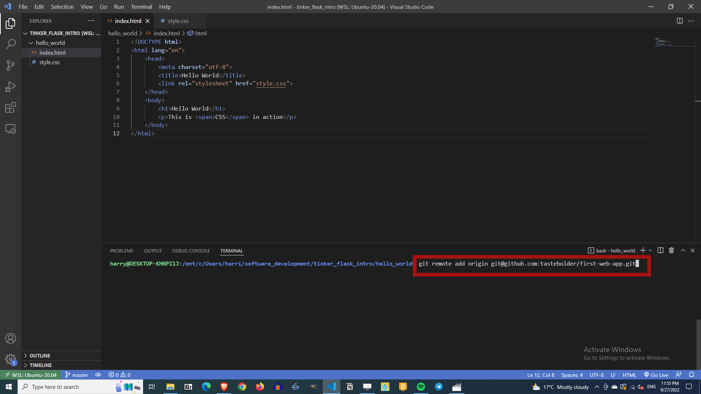

_origin_ is a remote repository that connects the local machine to the remote server. Above, we have added our SSH method of authentication when accessing the remote server.

### Step 8

Finally, we can now push our changes to GitHub by running the command below on VS Code:

```python
git push -u origin main
```


### Step 9

Now let us reload our GitHub page to see the changes we have made thus far.

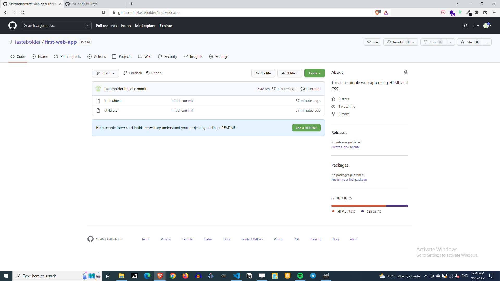

Congratulations! That is how you get a copy of your project to a remote server such as GitHub.


### Adding a README file

If you have observed the new project repository, it asks that we add a README file so as to help people interested to know what the project is all about. A README file is normally used to provide more information to anyone who sees our project.

At the moment, our project has only two files, _index.html_ and _style.css_. We need to add a new file called _README.md_ to the project structure. This can be done as follows:

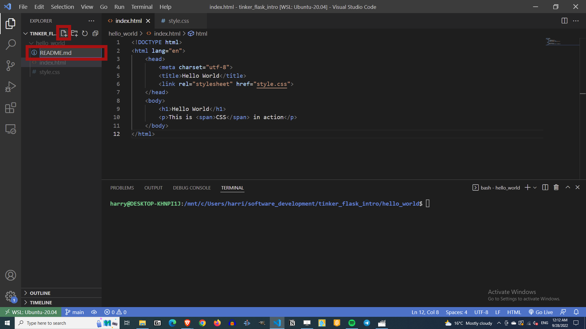

We need to say something about this project. Since there is not much going on with the project, we can simple say this:

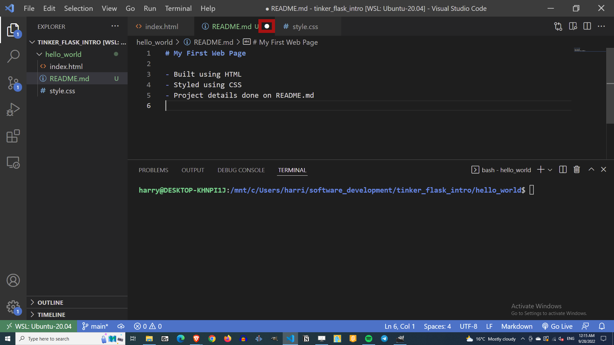

Remember to save your file by pressing **"Ctrl + S"** if you see the small white dot at the top of the file. Then run these commands in the following order to push it to GitHub:

```python
git add README.md
git commit -m 'Add a README file'
git push origin main
```


Now, if you reload your repository, you should be able to see your changes.

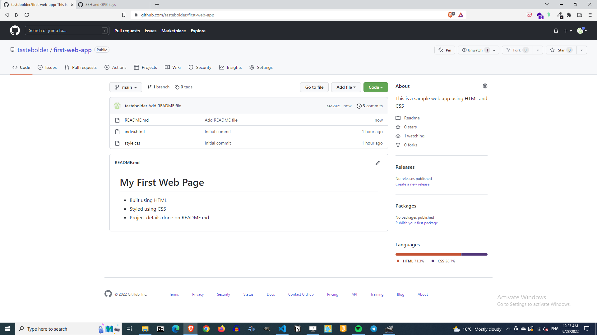


### Approach 2: Get a Project Already Found on GitHub

Let us say you were looking around in GitHub and you came across a project that you really liked, and you want to buil on it instead of starting from scratch. How do you go about it?

### Step 1

Find the project on GitHub. For example, this project: https://github.com/GitauHarrison/africanshortstorieswebsite.


### Step 2

Copy the SSH link from the repository

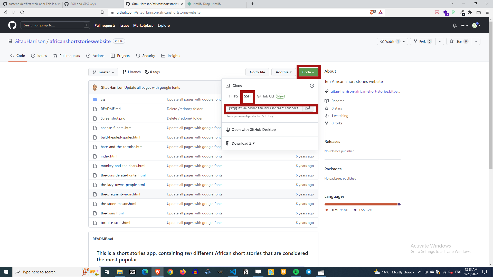


### Step 3

Ensure that you are in an appropriate folder in your local machine. In the example below, we go back on step from our folder _hello_world_ to the parent folder _tinker_flask_intro_. This is achieved by running the command seen below:

```python
cd ..
```

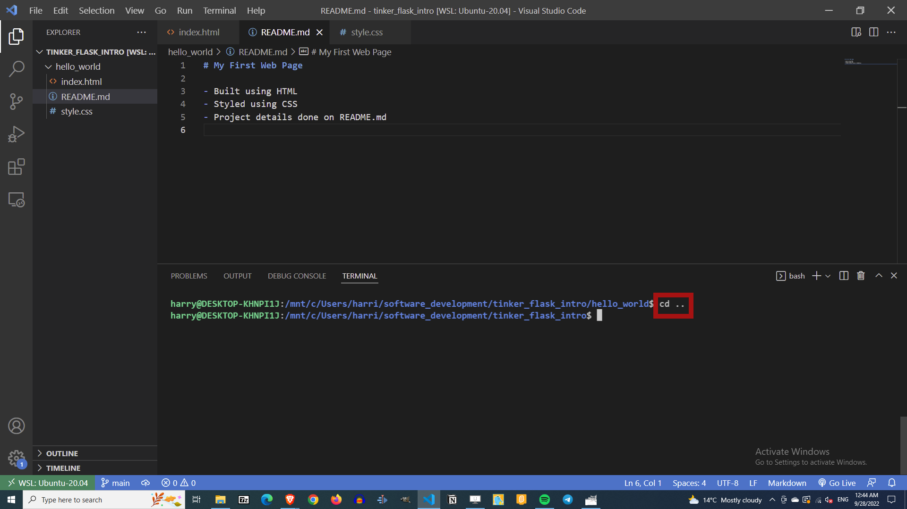


### Step 4

Open your VS Code terminal and run this command:

```python
git clone git@github.com:GitauHarrison/africanshortstorieswebsite.git
```

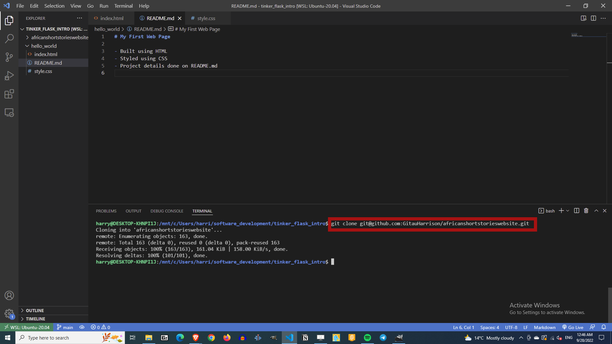

Notice that we have a new folder at the same location as our original_hello_world_ folder.

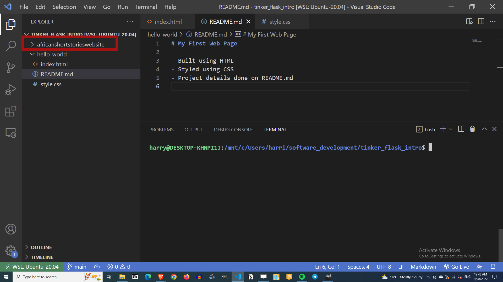

At this point, you can interact with the _africanshortstorieswebsite_ contents to your heart's desire.

## Conclusion

GitHub hosts Git repositories and provides developers with tools to ship better code through command line features, issues (threaded discussions), pull requests, or code review. GitHub builds collaboration directly into the development process. Work is organized into repositories where developers can outline requirements or direction and set expectations for team members. Then, using the GitHub flow, developers simply create a branch to work on updates, commit changes to save them, open a pull request to propose and discuss changes, and merge pull requests once everyone is on the same page.