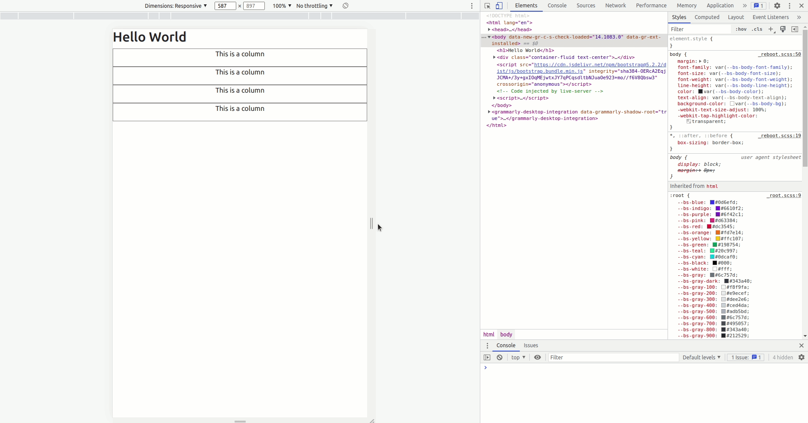

# Working with Templates in Flask


A template is basically an HTML file. In our previous lesson [Getting Started With Flask](03_getting_started_with_flask.md), we learnt how to display the text "Hello, world" on a browser. What if you want to add more structure to your application, like paragraphs and images? How can you do that in Flask? This is where templates come in. They allow us to achieve all the structural features we may want added to our application.

Throughout this tutorial, these are the reference links of the things we will be looking at. At your own convinience, you can navigate to whatever article you want to refer to:

1. [Getting Started with HTML and CSS](01_getting_started_with_HTML_and_CSS.md)
2. [Git and GitHub](02_git_and_github.md)
3. [Getting Started with Flask](03_getting_started_with_flask.md)
4. [Introduction to Bootstrap](04_bootstrap_intro.md)   (this article)
5. [Working with Templates](05_working_with_templates.md)


This article will cover these topics:

- [Introduction to Bootstrap](#introduction-to-bootstrap)
- [Grid Layout](#grid-layout)
- [Understanding Breakpoints](#understanding-breakpoints)
- [Assignment: Responsive Web Page](#assignment-responsive-web-page)


## Introduction to Bootstrap

[Bootstrap](https://getbootstrap.com/) is a powerful front-end framework for faster and easier web development. It includes HTML and CSS based design templates for creating common user interface components like forms, buttons, navigations, dropdowns, alerts, modals, tabs, accordions, carousels, tooltips, and so on. 

> Bootstrap gives you ability to create flexible and responsive web layouts with much less efforts.

Whenever you are developing any web application, the silent rule of thumb is to build mobile-first. What this means is that you begin by designing your application based on how it will look on a mobile phone, then maybe on a tablet, and a desktop. 

### Bootstrap Quick start

In this section, you will learn how to use Bootstrap on a plain HTML template. We will begin by including Bootstrap’s production-ready CSS and JavaScript via CDN without the need for any build steps.


### Step 1: Create a New Project Folder

Open your VS Code and create a new project folder called _bootstrap_intro_.


### Step 2: Create an HTML Templates

Now, create an HTML file called `index.html`


### Step 3: Create Sample Web Page

Let us update our `index.html` file with the following code that creates a simple web page.


### Step 4: Include Bootstrap’s CSS and JS

Bootstrap requires us to use its two files, namely:

| Description | URL |
| ----------- | --- |
|     CSS     | https://cdn.jsdelivr.net/npm/bootstrap@5.2.2/dist/css/bootstrap.min.css |
|     JS      | https://cdn.jsdelivr.net/npm/bootstrap@5.2.2/dist/js/bootstrap.bundle.min.js |

In our `index.html` file, let us add links to Bootstrap CSS file and Bootstrap JS file


You do not have to memorize these links. To make your work easier, simply head over to the [Bootstrap documentation](https://getbootstrap.com/docs/5.2/getting-started/introduction/) and copy the links from there.


### Step 5: Navigate to Bootstrap Folder


In our terminal, we need to change the directory to reflect our current folder which is _bootstrap_intro_.


### Step 6: Run Code

Click on _Go Live_ to see your web page.


### Step 7: Access Web Page on Browser

Our simple web page should be running on our default browser as seen below.


At this point, there is noting visibly special about our web page. 


## Grid Layout

A grid is a combination of containers, rows and columns which are used to lay out and align content. Built using [flexbox](https://developer.mozilla.org/en-US/docs/Web/CSS/CSS_Flexible_Box_Layout/Basic_Concepts_of_Flexbox), it is fully responsive. 


### Row

To understand how the grid system works, let us look at these visual representations. We begin by understanding what a row is (horizontal):


### Columns

Then, this is a column (vertical):


### Total Columns in a Row

A row is made up of up to 12 columns.


### Combination of Columns in a Row

You can divide the number of columns in a row as much as you want. The total number of columns in a row need to add up to 12.


To translate these visual representations to code, let us see this example:


### Step 1: Add Rows and Columns

Update the `index.html` file to include the code below:


### Step 2: Navigate to Browser

On our default browser, you should be able to see 4 paragraphs saying "This is a column"


### Step 3: Add Styling

If you are not so certain that what we have just done are actually columns, we can add a bit of borders around each column for greater visibility. Create a `styles.css` file and add this border style.


### Step 4: Link CSS file to HTML File

Before the style can be applied to targeted elements, we need to create a connection between our `style.css` file and the `index.html` file.


### Step 5: Target Each Column

We need to now target each column in `index.html` to apply the style we want. To do this, we will add a class called `columns` in each column.

 


### Step 6: View Web Page

Now, let us check the changes that have occurred on our web page.


Notice that when using the grid system, we have do the following:

- Call a _row_ as class `row`
- Define a _column_ as class `col`

In our code, the changes were effected as follows (You do not have to write this again):

```html
<!-- index.html -->

<div class="container-fuild text-center">     <!-- define your container on this outer element -->
    <div class="row">                         <!-- Here, you call your row -->
        <div class="col-md-3">                <!-- Here, you define your column of size 3 -->
            <p>This is a column of size 4</p>
        </div>
        <div class="col-md-3">                <!-- Here, you define your column of size 3 -->
            <p>This is a column of size 4</p>
        </div>
        <div class="col-md-3">                <!-- Here, you define your column of size 3 -->
            <p>This is a column of size 4</p>
        </div>
        <div class="col-md-3">                <!-- Here, you define your column of size 3 -->
            <p>This is a column of size 4</p>
        </div>
    </div>
</div>
```


## Understanding Breakpoints

As mentioned, the approach that Bootstrap uses is mobile first. We build our web application from the size of a mobile phone then scale it up on need basis. There are six default break points:

|    Breakpoint         |    Class Infix    |    Dimensions    |
|    ---------------    |    -----------    |    ----------    |
|     Extra small       |    None           |    <576px        |
|     Small             |    `sm`           |    ≥576px        |
|     Medium            |    `md`           |    ≥768px        |
|     Large             |    `lg`           |    ≥992px        |
|     Extra large       |    `xl`           |    ≥1200px       |
|     Extra extra large |    `xxl`          |    ≥1400px       |

In our `index.html` file, you have seen the use of the breakpoint `md`. Basically, we targeted devices of medium viewport, that is, screen sizes of greater than or equal to 768 pixels. 

One more important thing to pay attention to when building responsive web pages using the mobile-first approach is this line in our HTML file:


What this line does is it **ensures proper rendering and touch zooming for all devices**. Always remember to add this line to your responsive web page. Let us see how the page we have created appears on multiple viewports (viewport means 'screen size').


### Step 1: Inspect A Page

Right-click your mouse to access the shortcut "Inspect".


Alternatively, you may click on the menu command to access "Settings"


You will see this page:


### Step 2: Select Responsive

Ensure that you have selected "Responsive" from the dropdown menu.


### Step 3: Web Page on Multiple Viewports

Drag the edge of the inspection page to view how the page will look like in different viewports.




## Assignment: Responsive Web Page

Now that you have basic understanding of what a responsive web page is, let us put that knowledge to the test. Below, I have a sample web page built using HTML and CSS. 


These are the tasks you are required to do:

- [ ] Recreate the web page exactly as it looks
- [ ] You can add custom styles to the web page
- [ ] Push your final code to GitHub

